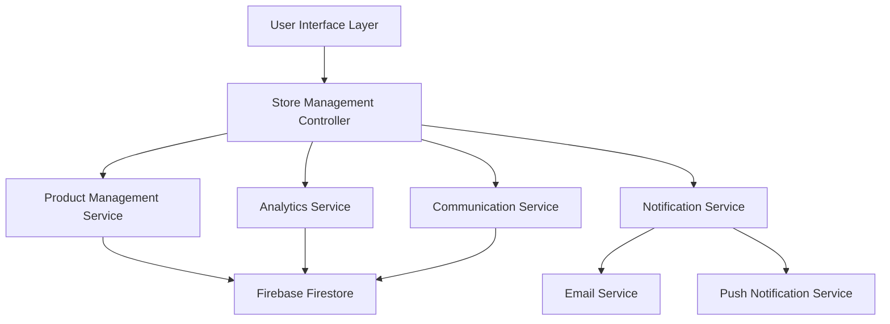

# Design Document

## Overview

The User Store Management feature will provide sellers with a comprehensive dashboard to manage their product listings, track performance, and communicate with buyers. The system will be built as a new section within the existing campus marketplace platform, leveraging the current authentication, database, and UI components while adding new specialized functionality for seller management.

## Architecture

### High-Level Architecture



### Component Structure

- **Store Dashboard**: Main landing page showing overview and quick actions
- **Product Manager**: CRUD operations for product listings
- **Analytics Dashboard**: Performance metrics and insights
- **Inquiry Manager**: Communication with potential buyers
- **Settings Panel**: Store preferences and automation rules

## Components and Interfaces

### 1. Store Dashboard Component

**Location**: `/app/store/page.js`

**Props Interface**:
```typescript
interface StoreDashboardProps {
  user: User;
  products: Product[];
  analytics: StoreAnalytics;
  inquiries: Inquiry[];
}
```

**Key Features**:
- Overview cards showing total products, views, inquiries, and sales
- Quick action buttons for adding new products
- Recent activity feed
- Performance charts
- Unread inquiry notifications

### 2. Product Management Component

**Location**: `/app/store/products/page.js`

**Props Interface**:
```typescript
interface ProductManagerProps {
  products: Product[];
  categories: Category[];
  onEdit: (productId: string) => void;
  onDelete: (productId: string) => void;
  onStatusChange: (productId: string, status: ProductStatus) => void;
  onDuplicate: (productId: string) => void;
}
```

**Key Features**:
- Sortable and filterable product table
- Bulk operations (delete, status change, tag application)
- Inline editing for quick updates
- Product status indicators
- Performance metrics per product

### 3. Product Edit Form Component

**Location**: `/app/store/products/edit/[id]/page.js`

**Props Interface**:
```typescript
interface ProductEditFormProps {
  product?: Product;
  categories: Category[];
  onSave: (productData: ProductFormData) => Promise<void>;
  onCancel: () => void;
  isLoading: boolean;
}
```

**Key Features**:
- Form validation with real-time feedback
- Image upload with preview and cropping
- Category and tag selection
- Price formatting and validation
- Auto-save functionality

### 4. Analytics Dashboard Component

**Location**: `/app/store/analytics/page.js`

**Props Interface**:
```typescript
interface AnalyticsDashboardProps {
  analytics: StoreAnalytics;
  dateRange: DateRange;
  onDateRangeChange: (range: DateRange) => void;
}
```

**Key Features**:
- Interactive charts using Chart.js or similar
- Key performance indicators (KPIs)
- Product performance comparison
- Trend analysis
- Export functionality

### 5. Inquiry Manager Component

**Location**: `/app/store/inquiries/page.js`

**Props Interface**:
```typescript
interface InquiryManagerProps {
  inquiries: Inquiry[];
  products: Product[];
  onReply: (inquiryId: string, message: string) => Promise<void>;
  onMarkComplete: (inquiryId: string) => Promise<void>;
}
```

**Key Features**:
- Threaded conversation view
- Quick reply templates
- Inquiry status management
- Product context display
- Notification management

## Data Models

### Product Model Extension

```typescript
interface Product {
  id: string;
  title: string;
  description: string;
  price: number;
  category: string;
  subcategory?: string;
  images: string[];
  status: 'active' | 'sold' | 'unavailable' | 'draft';
  tags: string[];
  sellerId: string;
  createdAt: Date;
  updatedAt: Date;
  
  // Analytics fields
  viewCount: number;
  inquiryCount: number;
  favoriteCount: number;
  
  // Store management fields
  lastEditedAt?: Date;
  autoResponses?: AutoResponse[];
  policies?: SellerPolicies;
}
```

### Store Analytics Model

```typescript
interface StoreAnalytics {
  sellerId: string;
  totalProducts: number;
  activeProducts: number;
  soldProducts: number;
  totalViews: number;
  totalInquiries: number;
  conversionRate: number;
  averageViewsPerProduct: number;
  topPerformingProducts: ProductPerformance[];
  recentActivity: ActivityLog[];
  monthlyStats: MonthlyStats[];
}
```

### Inquiry Model

```typescript
interface Inquiry {
  id: string;
  productId: string;
  buyerId: string;
  sellerId: string;
  subject: string;
  messages: Message[];
  status: 'open' | 'replied' | 'completed' | 'closed';
  createdAt: Date;
  lastMessageAt: Date;
}

interface Message {
  id: string;
  senderId: string;
  content: string;
  timestamp: Date;
  isRead: boolean;
  attachments?: string[];
}
```

## Error Handling

### Client-Side Error Handling

1. **Form Validation Errors**: Display inline validation messages with clear instructions
2. **Network Errors**: Show retry buttons and offline indicators
3. **Permission Errors**: Redirect to authentication or show access denied messages
4. **Data Loading Errors**: Display error states with refresh options

### Server-Side Error Handling

1. **Database Errors**: Log errors and return user-friendly messages
2. **Authentication Errors**: Return 401 status with redirect instructions
3. **Validation Errors**: Return detailed field-level error information
4. **Rate Limiting**: Implement and communicate rate limits to users

## Testing Strategy

### Unit Testing

- Test all service functions with mock data
- Validate form validation logic
- Test data transformation utilities
- Mock Firebase operations for consistent testing

### Integration Testing

- Test complete user workflows (create, edit, delete products)
- Verify database operations with test data
- Test authentication and authorization flows
- Validate email and notification sending

### End-to-End Testing

- Test complete user journeys from login to product management
- Verify responsive design across devices
- Test accessibility features with screen readers
- Validate performance under load

### Component Testing

- Test React components in isolation
- Verify prop handling and state management
- Test user interactions and event handling
- Validate responsive behavior

## Security Considerations

### Authentication and Authorization

- Verify user ownership of products before allowing modifications
- Implement role-based access control for different user types
- Use secure session management with proper token expiration
- Validate all user inputs on both client and server sides

### Data Protection

- Sanitize all user inputs to prevent XSS attacks
- Use parameterized queries to prevent SQL injection
- Implement rate limiting to prevent abuse
- Encrypt sensitive data in transit and at rest

### Privacy

- Allow users to control visibility of their store information
- Implement data retention policies for analytics data
- Provide data export and deletion options for GDPR compliance
- Anonymize data in analytics where possible

## Performance Optimization

### Frontend Optimization

- Implement lazy loading for product images and components
- Use React.memo and useMemo for expensive computations
- Implement virtual scrolling for large product lists
- Optimize bundle size with code splitting

### Backend Optimization

- Implement database indexing for common queries
- Use caching for frequently accessed data
- Implement pagination for large datasets
- Optimize image storage and delivery with CDN

### Database Design

- Design efficient queries with proper indexing
- Implement data archiving for old products
- Use database triggers for maintaining analytics data
- Optimize for read-heavy workloads with appropriate caching

## Accessibility Features

### WCAG 2.1 AA Compliance

- Implement proper heading hierarchy and semantic HTML
- Provide alt text for all images and icons
- Ensure keyboard navigation for all interactive elements
- Maintain sufficient color contrast ratios

### Screen Reader Support

- Use ARIA labels and descriptions appropriately
- Implement live regions for dynamic content updates
- Provide skip links for navigation
- Test with popular screen readers (NVDA, JAWS, VoiceOver)

### Mobile Accessibility

- Ensure touch targets meet minimum size requirements
- Implement proper focus management for mobile devices
- Support voice input and dictation features
- Test with mobile accessibility tools

## Responsive Design

### Breakpoint Strategy

- Mobile: 320px - 767px (single column layout)
- Tablet: 768px - 1023px (two column layout)
- Desktop: 1024px+ (multi-column layout with sidebar)

### Mobile-First Approach

- Design core functionality for mobile devices first
- Progressive enhancement for larger screens
- Touch-friendly interface elements
- Optimized performance for mobile networks

### Component Responsiveness

- Use CSS Grid and Flexbox for flexible layouts
- Implement responsive typography with clamp()
- Optimize images for different screen densities
- Test across various device sizes and orientations